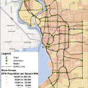

# HazmatNetworkData

* Original Source: http://hazmat.chkwon.net/resources/
* Prepared by [Changhyun Kwon](http://www.chkwon.net) and his students.

This repository contains two road network data, which may be useful for research in hazardous materials transportation. See the `data` directory of this repository for data. The listed research articles used the data. 

* Albany Network
  - [Kang, Y., R. Batta and C. Kwon (2014), “Value-at-Risk Model for Hazardous Material Transportation”, Annals of Operations Research, 222(1), 361–387.](http://dx.doi.org/10.1007/s10479-012-1285-0)
  - [Kang, Y., R. Batta and C. Kwon (2014), “Generalized Route Planning Model for Hazardous Material Transportation with VaR and Equity Considerations”, Computers & Operations Research, 43, 237–247.](http://dx.doi.org/10.1016/j.cor.2013.09.015)
  - [Toumazis, I., C. Kwon, and R. Batta (2013), “Value-at-Risk and Conditional Value-at-Risk Minimization for Hazardous Materials Routing”, in Handbook of OR/MS Models in Hazardous Materials Transportation (Eds.:R. Batta and C. Kwon), Springer](http://dx.doi.org/10.1007/978-1-4614-6794-6_5)

* Buffalo Network
  - [Toumazis, I. and C. Kwon (2016), “Worst-case Conditional Value-at-Risk Minimization for Hazardous Materials Transportation”, Transportation Science, 50(4), 1174–1187](http://dx.doi.org/10.1287/trsc.2015.0639)
  - [Toumazis, I. and C. Kwon (2013), “Routing Hazardous Materials on Time-Dependent Networks using Conditional Value-at-Risk”, Transportation Research Part C: Emerging Technologies, 37, 73–92.](http://dx.doi.org/10.1016/j.trc.2013.09.006)
  - [Esfandeh, T., R. Batta, and C. Kwon (2018), “Time-Dependent Hazardous-materials Network Design Problem”, Transportation Science, 52(2), 229-496.](https://doi.org/10.1287/trsc.2016.0698)

(*If you use these datasets in your paper, please feel free to add to the above list.*)

# Data Sources
- US Census 2010 <http://www.census.gov/2010census>
- Federal Highway Administration, Publications & Statistics <http://www.fhwa.dot.gov/resources/pubstats>
- Federal Motor Carrier Safety Administration, Statistics and Facts <http://www.fmcsa.dot.gov/facts-research/art-stats-facts.htm>
- New York State Department of Transportation, Traffic Volume Data <https://www.dot.ny.gov/divisions/engineering/technical-services/highway-data-services/hdsb?nd=nysdot>
- Pipeline and Hazardous Materials Safety Administrator, Data & Statistics <http://phmsa.dot.gov/hazmat/library/data-stats>
- New York State Thruway Authority <http://www.thruway.ny.gov/index.shtml>
- Greater Buffalo-Niagara Regional Transportation Council, Transportation Data Management System <http://gbnrtc.org/index.php/resources/data/traffic-count-database-system/>
- U.S. Hazardous Materials Report <http://www.census.gov/econ/cfs/>, Commodity Flow Survey, U.S. Census Bureau
- Hazmat Incidents Databases:
  - Incident Reports Database Search <https://hazmatonline.phmsa.dot.gov/IncidentReportsSearch/search.aspx>, U.S. Department of Transportation
  - Yearly Incident Summary Reports–Hazmat Intelligence Portal <https://hip.phmsa.dot.gov/analyticsSOAP/saw.dll?Dashboard&NQUser=HazmatWebsiteUser1&NQPassword=HazmatWebsiteUser1&PortalPath=/shared/Public%20Website%20Pages/_portal/Yearly%20Incident%20Summary%20Reports>, U.S. Department of Transportation
- Spills and Accidents Database <http://www.rtknet.org/db/erns/>, The Right-to-Know Network
- Databases: Hazardous Material Incident Logbook Search <http://www.azdeq.gov/databases/hwssearch.html>, Arizona Department of Environmental Quality
Environmental Releases <http://apps.dnrec.state.de.us/derns/pub/RecentReleases.aspx>, Delaware Department of Natural Resources and Environmental Control
- Hazardous Materials Spills <https://data.illinois.gov/Environment/IEMA-Hazardous-Material-Spills/s296-ttzm>, Illinois Emergency Management Agency
- Spill Incidents Database Search <http://www.dec.ny.gov/cfmx/extapps/derexternal/index.cfm?pageid=2>, New York Department of Environmental Conservation
- Hazardous Materials Incident Reports <http://www.oregon.gov/OSP/SFM/Pages/CR2K_InfoAvailable.aspx#Hazardous_Materials_Incident_Reports>, Oregon State Police
 
 
# Relevant Links
- U.S. Department of Transportation, Pipeline and Hazardous Materials Safety Administration (PHMSA) <http://phmsa.dot.gov/hazmat>
- Hazmat page by the Federal Emergency Management Agency, U.S. Department of Homeland Security <http://www.fema.gov/hazard/hazmat/index.shtm>